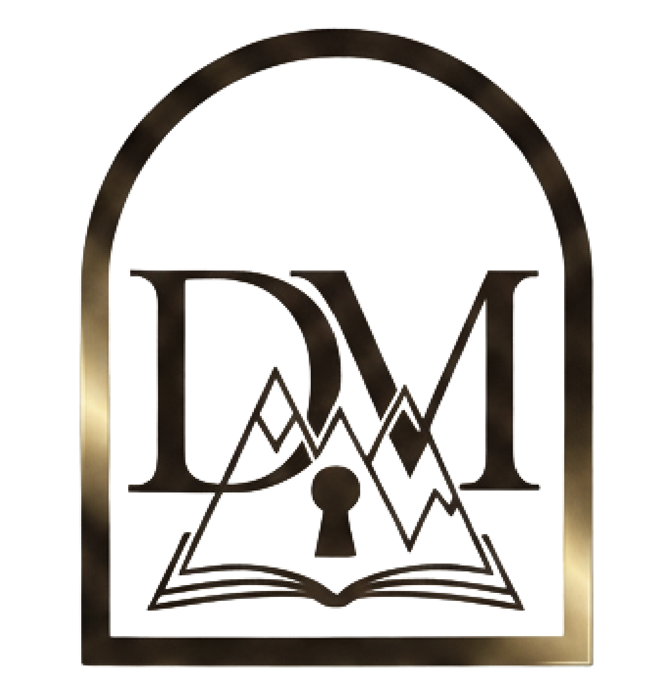

# Domus Memoriae

A Home for Time Should Never Erase

> A secure, generational digital heirloom that actively monitors and preserves your family's most treasured files against time and format obsolescence.

---

## Inspiration
Traditional cloud storage is often treated like a digital junk drawer—files go in, get forgotten, and formats silently become obsolete over time. As our lives become increasingly digital, we realized we are at a severe risk of losing our family histories to "data rot" and inaccessible file types. 

Developed for **CalgaryHacks 2026**, Domus Memoriae was built in direct response to **Topic 2: "Preserve Today for Tomorrow: Why Archives Matter"**. We wanted to rethink digital storage not as a temporary hard drive, but as a permanent, living archive that actively fights to keep your data readable for future generations.

---

## What It Does
Domus Memoriae is a **family archive platform** that provides a centralized, highly secure "Vault" for your legacy. Rather than passively holding files, it actively evaluates their health to ensure they survive for decades.

It serves as a collaborative space for families:
- **The Vault** — A secure, shared environment where families can pool photos, videos, audio, and critical documents.
- **The Archive Engine** — An automated system that calculates "Resilience" and "Access Risk" scores, warning users if a specific file format is in danger of becoming unreadable in the future.

### Key Features
- **Archive Resilience & Risk Scoring:** Real-time evaluation of how "at-risk" a file is based on its extension, metadata richness, and duplicate counts.
- **Safe Full-Screen Previews:** Strict MIME-type enforcement allows users to safely preview PDFs, text documents, images, and video directly in the browser without triggering unwanted downloads.
- **Family Collaboration:** Easily generate and share secure join codes to invite family members to view and contribute to the archive.
- **Timeless UI/UX:** A distraction-free, elegant interface built with a vintage parchment-and-ink aesthetic using *Cormorant Garamond* and *Crimson Text* typography.

---

## How We Built It

**Tech Stack:**
- **Frontend:** React, React Router, Custom CSS (CSS Variables, Flexbox, Grid)
- **Backend:** RESTful API 
- **File Handling:** Multipart form data uploading with strict Blob processing
- **Typography:** Google Fonts Integration

**Architecture:**
- **Frontend SPA:** The React application handles dynamic view switching, routing, and complex Blob processing to force inline file rendering (preventing auto-downloads for text and PDF formats).
- **Smart Uploads:** When a file is uploaded, the backend generates a `sha256` hash to detect duplicates and prevent vault bloat.
- **Database Schema:** Tracks claimed vs. detected MIME types, file sizes, access counts, and calculated risk reasons to maintain the overarching "health" of the Vault.

---

### The Archivists
> A collaboration built during CalgaryHacks 2026, focused on **longevity, digital heritage, and building software that outlasts us.**

### Tarun Jaswal  
GitHub: https://github.com/tjasw549

### Ochihai Omuha
GitHub: https://github.com/oomuh570

### Abiola Raji 
GitHub: https://github.com/Abiolr
